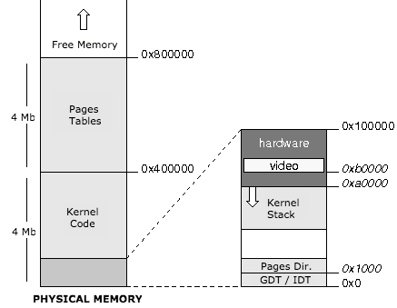
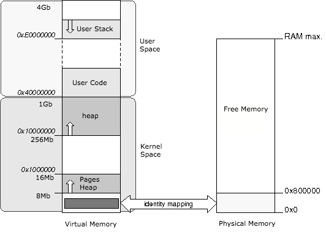

# Memory management: physical and virtual

The kernel knows the size of the physical memory available thanks to [Grub](../Chapter-3/README.md).

In our implementation, the first 8 megabytes of physical memory will be reserved for use by the kernel and will contain:

- The kernel
- GDT, IDT et TSS
- Kernel Stack
- Some space reserved to hardware (video memory, ..)
- Page directory and pages table for the kernel

The rest of the physical memory is freely available to the kernel and applications.

### Virtual Memory Mapping

The address space between the beginning of memory and `0x40000000` address is the kernel space, while the space between the address `0x40000000` and the end of the memory corresponds to user space:

